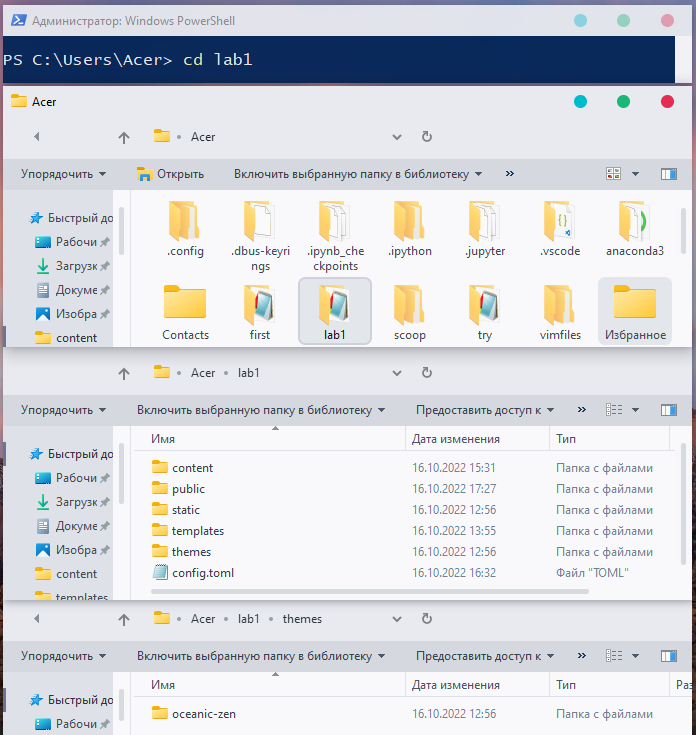

+++
title = "Step 4: Let's make a site"
description = "In this section we are going to make the site like this. Finally."
weight = 4
+++

After all the installations and guidelines you are finally on the last step and going to make a site.
Make sure that you've read the previous steps and let's start.

Open your PowerShell and create a project - **zola init [name]** - if you haven't done that yet.

### Themes

We are going to install the theme called [Oceanic Zen](https://www.getzola.org/themes/oceanic-zen).
Open up Git CMD ([install it](https://git-scm.com/downloads)) and write the code: 

---
> cd themes  
> git clone https://github.com/barlog-m/oceanic-zen.git
---
See green letters? Then everything is alright, and we can continue.

Now as we got the theme, we can check if it is in our project's folder:  

Ok, it's here. The last thing we need to do here is to add a couple of lines to **config.toml**,
> theme = "oceanic-zen"

add some information into [extra] and edit it.  

> [extra]  
> author = "blog author name"  
> github = "github author name"  
> twitter = "twitter author name"  

If you don't understand where to put these lines, please, check the previous step.

Next we need to write **zola serve** in PowerShell.  
Put **http://127.0.0.1:1111** in browser and look at your website-to-be.   Isn't that beautiful? ^-^

### Templates

We told you in the previous step that we'd put index.html file in this folder. If you haven't done it yet, let's do this.
Open **name_of_the_project\themes\oceanic-zen\templates** and copy **index.html** and place it into **name_of_the_project\templates**.

Let's see what we have changed with before/after figures. 
First, we wanted two authors and links to our **github** and **vkontakte** to be on the upper right of the page.

Second, we added greetings to our main page.

Third, we added the picture that we liked to our main page.

And the last thing that we did - we added one extra name again at the bottom of the page
and the link to the website where we took "vkontakte" icon because that was the rule of free using of the logo.

You can make these or any other edits that you want and come back to our guideline.

### Content

To create a folder in **content** you can open **name_of_the_project/content** and create a folder or do it through PowerShell. Let's do this. 
For example, we want to create an _index.md inside of the folder called **make_a_site**. What we need to type is:

---
> vim content/make_a_site/_index.md
---

Press **Enter**. You have just opened _index.md in **vim**. Press "i" on your keyboard and write your title: 

---
> +++  
> title = "name_of_the_title"  
> +++  
---

You also can press the right button on a mouse to paste some text that you copied beforehand. It might be much easier than typing it from keyboard.

When you finish press **Esc** and write **:wq** to save and quit.
**Vim** is not easy and not so comfortable to work with, so you might need some more information about
[the modes](https://www.freecodecamp.org/news/vim-editor-modes-explained/)
and [the most popular commands](https://www.freecodecamp.org/news/how-not-to-be-afraid-of-vim-anymore-ec0b7264b0ae/).

If you want to edit an .md file you can open it up without **vim**, just through folders. So don't waste your nerves.
You also can install all used files from our githubs or - that sounds stupid but - you have text of our website pages
on our website pages, so you can just copy it, and then try to edit it practicing your coding using the commands from the last steps.

### Static

As we said before, we use static for icons and the image from the main page.
Copy icons from **themes\oceanic-zen\static\icons** if you want to change icons and add images that you need.

### Config.toml

You can just add a title:
> title = "Zola For Dummies*"   

Now we are at the finish line! All that's left to do is to type ~~Simsalabim~~ **zola build** and ...

## Congratulations! You made your own site!