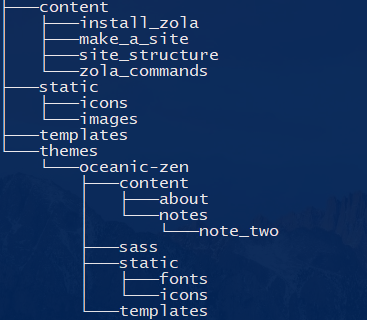
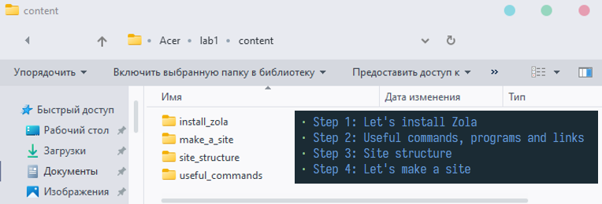
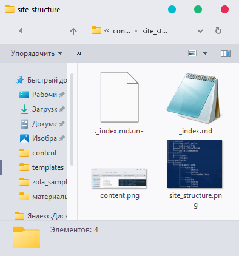
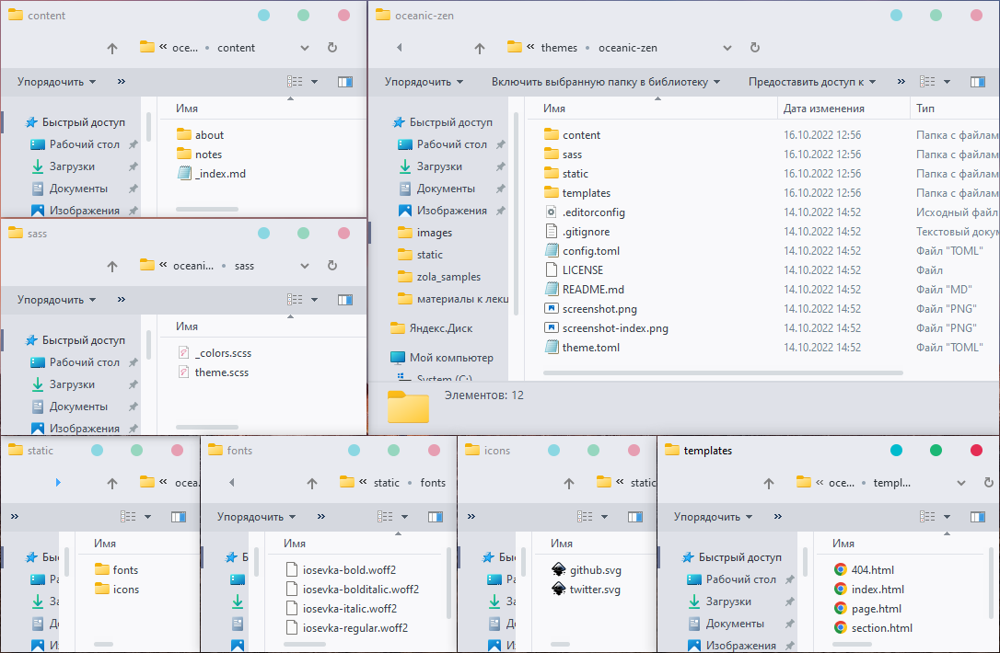
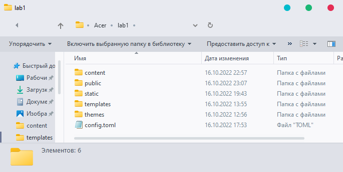
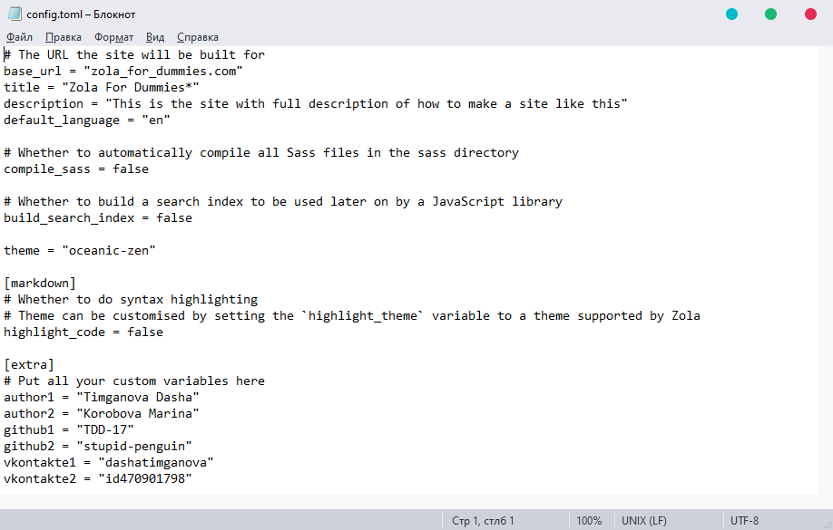

+++
title = "Step 3: Site structure"
description = "This is the section where we show the structure of our site"
weight = 3
+++

I made this site and it has the structure:

<ul>
<li> main page  
<li> sections:  
> Step 1: Let's install Zola  
> Step 2: Useful commands, programs and links  
> Step 3: Site structure  
> Step 4: Let's make a site  

and a lot of scary folders:  

Let's go through (almost) each of them.

### Content

We use the folder **content** for my **section pages**.  
In each folder we have an **_index.md** file (md means [Markdown](https://en.wikipedia.org/wiki/Markdown)). 
.md file makes a section page of this folder.   If you create a folder without an .md file, it will be just a folder.

My **content\make_a_site\\_index.md** looks like this:

We also put screenshots and pictures in folders where needed, as you can see in the picture below.  

### Static

We use static for icons and (some of the) images.

**Icons** are .svg images/logos which you have on <i>each page</i> of your website like "github" and "vkontakte" on the upper right (look at them! now!),
that's why we don't add them to **content** folders. It's just simplier for us to add them to static.

We also use **static** for our teapot image from the main page. Why teapot? Local jokes. 
So, teapot's picture is in static, because we don't have a special _index.md file for the main page.

Let's see what else is in our pockets...

### Templates and Themes

**Theme** is a list of folders with its own structure, templates and items which make your site look beautiful.
They add color and style to your pages and text, and give you a number of functions.

We are going to install the theme in the next step. 

As for the **templates**, you can <i>copy</i> from **name_of_the_project\themes\oceanic-zen\templates**
and paste to the main templates folder: **name_of_the_project\templates** only those files which you are going to change.
We have changed index.html, thus we placed it into our main **templates** folder.
We'll tell you what exactly have been changed in this file in the next step. And *drum roll* ...

### Config.toml

Example of the **config.toml** is given below:

That's the file where you write your url address, title of the site, its description and language.
You can write a plenty of other things that you can read about on [Zola](https://www.getzola.org/documentation/getting-started/configuration) website.

Now let's go to the next step!